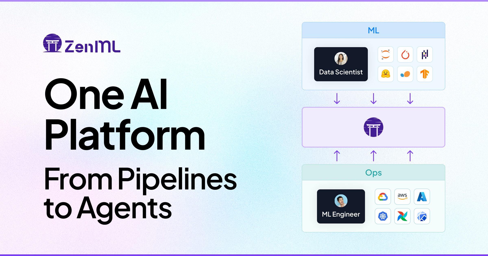
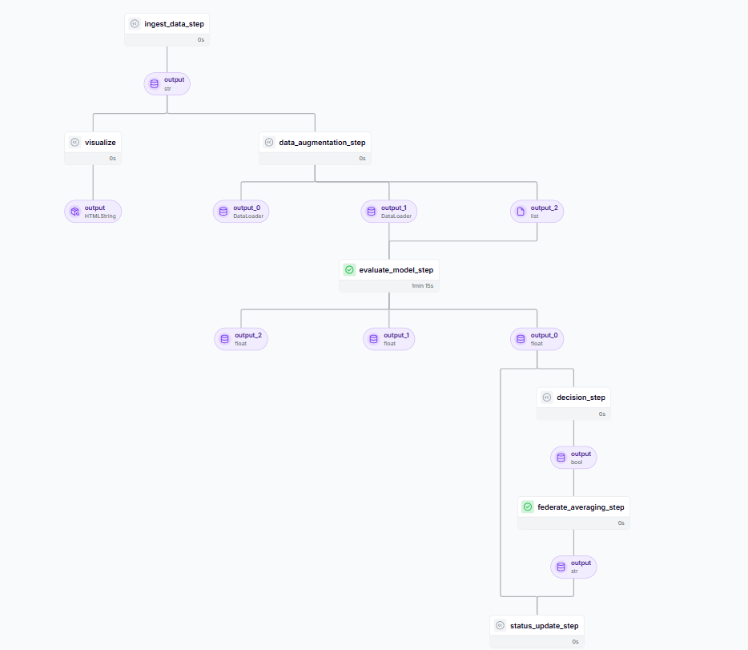

# federated-mlflow-pipeline
<p align="center">
  
</p>
This repository presents an end-to-end federated learning pipeline integrated with MLflow for experiment tracking, model versioning, and federated MLOps. In this pipeline, multiple clients train models locally on decentralized data, ensuring data privacy by keeping raw data on-device. Model aggregation is performed using a ZML-based averaging module, which combines client model updates into a single global model at the server side. After each federated round, the aggregated global model is persisted as a global model file, enabling reproducibility, version control, and continuous evaluation across training rounds.The pipeline supports systematic tracking of client-level metrics, global model performance, and federated training artifacts through MLflow, making it suitable for both research experimentation and production-oriented federated learning workflows.### Installation

### Work Flow Diagram

<p align="center">
  
</p>

```bash
# Clone the repository
git clone https://github.com/Amin-0513/federated-mlflow-pipeline.git

# Navigate to project directory
cd federated-mlflow-pipeline

# create python environment
python -m venv fedavg

# activate python environment
fedavg\Scripts\activate

# Install dependencies
pip install -r requirments.txt

zenml init

## Start project
uvicorn faderatedapi:app --host 0.0.0.0 --port 5003 --reload

```
